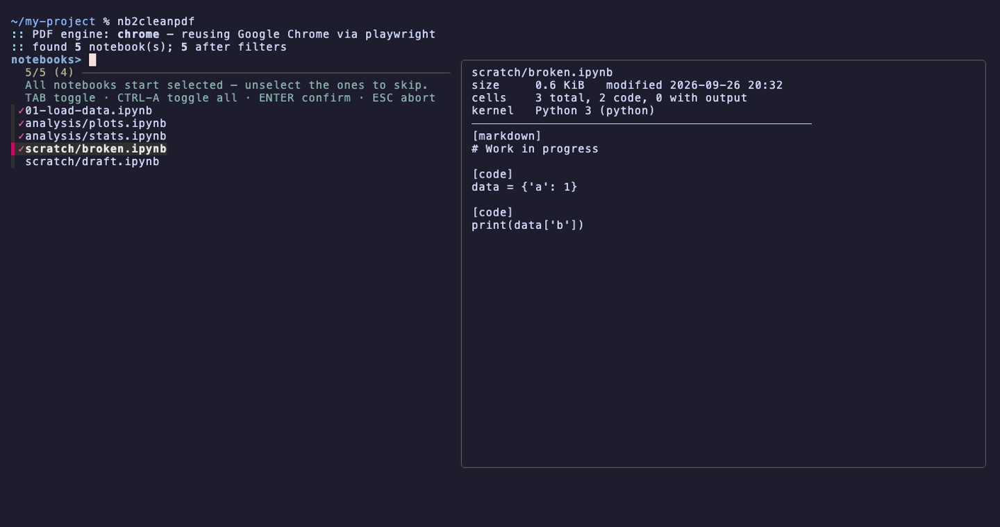
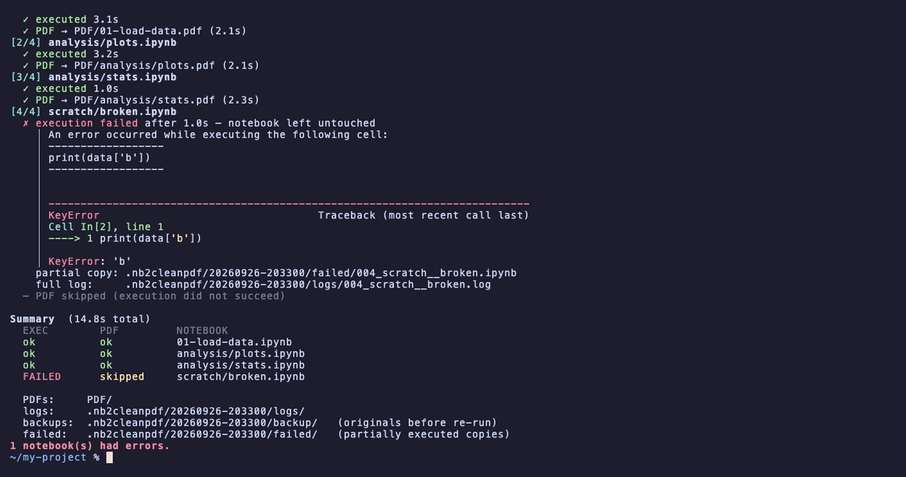

# nb2cleanpdf

[](https://github.com/Yuxin-Ren-SZ/nb2cleanpdf/actions/workflows/ci.yml)


[](https://docs.astral.sh/uv/)

[](LICENSE)
[](https://github.com/Yuxin-Ren-SZ/nb2cleanpdf/commits/main)

**English** | [简体中文](README.zh-CN.md)

Export **clean PDFs** of Jupyter notebooks: every notebook in a project is re-run
from scratch with the project's **uv** virtualenv (or a venv / conda environment you
choose), then exported to PDF (into `PDF/`).

- finds all `.ipynb` files (skips hidden dirs, `.venv`, `node_modules`, checkpoints)
- lets you unselect notebooks (fzf picker, or a numbered menu) and filter with `-i` / `-e` patterns
- runs each notebook in a fresh kernel from `./.venv` (or `--env local PATH` / `--env conda NAME`), with outputs cleared first and cwd set to the notebook's folder
- only overwrites a notebook when it ran without errors (atomic replace, backup kept in `.nb2cleanpdf/`)
- exports PDFs into `PDF/` (mirroring the folder layout) by reusing the Chrome/Edge/Brave you already have installed
- checks every dependency at start-up and offers to install what's missing
- `nb2cleanpdf clean` removes run records and whatever a killed run left behind

It's a single self-contained zsh script for macOS (Linux works too; both are tested in CI).
Windows is not supported natively; use WSL (tested in CI with Ubuntu on WSL 1).


## Install

```zsh
curl -fsSL https://raw.githubusercontent.com/Yuxin-Ren-SZ/nb2cleanpdf/main/install.sh | sh
```

This installs the latest code from `main`. To pin a
[release](https://github.com/Yuxin-Ren-SZ/nb2cleanpdf/releases), add `--version`:

```zsh
curl -fsSL https://raw.githubusercontent.com/Yuxin-Ren-SZ/nb2cleanpdf/main/install.sh | sh -s -- --version 0.3.1
```

or from a clone:

```zsh
git clone https://github.com/Yuxin-Ren-SZ/nb2cleanpdf && cd nb2cleanpdf
./install.sh                 # copies nb2cleanpdf to ~/.local/bin
./install.sh --link          # symlink instead, so `git pull` updates it
./install.sh --prefix /usr/local        # or --bin-dir DIR
./install.sh --uninstall
```

The installer only writes `<bin-dir>/nb2cleanpdf`, never overwrites a file that isn't
nb2cleanpdf (unless `--force`), and tells you if the bin dir is not on your `PATH`.

Requirements: zsh, [uv](https://docs.astral.sh/uv/), and a uv-created `.venv` in the
project — or another environment, see [Environments](#environments); none at all with
`--no-exec`. Everything else (jupyter, fzf, …) is checked at start-up, with the command that
installs it.

## Usage

```zsh
cd my-research-project
nb2cleanpdf                          # pick notebooks, re-run them, export PDFs to ./PDF/
nb2cleanpdf ~/research/other-proj    # same for another project, from anywhere
nb2cleanpdf -n                       # just list what would be processed
nb2cleanpdf --no-exec                # export as they are: no re-run, no environment needed
nb2cleanpdf -i 'analysis/*' -e '(#i)*draft*' -o ~/Desktop/pdfs -t 900
nb2cleanpdf -o .                     # PDFs next to each notebook instead of PDF/
nb2cleanpdf clean -n                 # show leftovers; `nb2cleanpdf clean` removes them
nb2cleanpdf -h                       # all options
nb2cleanpdf -V                       # installed version
```

The project directory (default: the current one) holds `.venv`, the notebooks, `PDF/`
and the run records in `.nb2cleanpdf/`. Paths given in options (`-o`, `--env`,
`--browser`, `--config`) are relative to where you run the command.

Always quote patterns. A plain word matches anywhere in the path; a glob with `/`
matches the whole relative path; a glob without `/` matches the file name.

**Only run notebooks you trust.** Every code cell is executed with your user's permissions,
exactly like *Run All* in Jupyter — there is no sandbox. Look through notebooks from
unknown sources before processing them.

### What it looks like

Pick notebooks — all start selected; the preview shows each notebook's cells:



Each notebook is re-run with a live progress line, then exported:


A failing notebook is left untouched; its error is shown, followed by a summary:



## Environments

Notebooks run in the project's uv venv by default. Pick another environment with `--env`:

```zsh
nb2cleanpdf                                  # --env uv: ./.venv, must be created by uv
nb2cleanpdf --env=uv:envs/py312              # a uv venv elsewhere (same as --venv DIR)
nb2cleanpdf --env local ./venv               # any venv: python -m venv, virtualenv, poetry, pdm…
nb2cleanpdf --env conda myenv                # conda / mamba / micromamba env, by name…
nb2cleanpdf --env conda ~/miniforge3/envs/x  # …or by prefix
```

- A conda env is activated the way `conda activate` does it, including its
  `etc/conda/activate.d` scripts and `conda env config vars`.
- Missing packages are installed with the environment's own tool — `uv`, the venv's `pip`,
  or `conda` / `mamba` / `micromamba install -c conda-forge`. The exact command is shown
  first and only runs if you agree (or with `--install-deps`).
- If the environment doesn't exist or is of another kind, nb2cleanpdf stops and prints
  the command to use instead; it never falls back to another environment.
- The `chrome` PDF engine still needs uv (it runs playwright from uv's cache).
- `--no-exec` exports the notebooks as they are (their saved outputs) and uses no environment
  at all: nbconvert runs from uv's cache, so it also works in a folder without a venv.

## Config file

Store the environment and other defaults in a config file, read **only** when you pass
`--config`. Command-line options override it.

```toml
# .nb2cleanpdf.toml  (in the project; or any file: --config path/to/file.toml)
env = "conda"
env_spec = "myenv"               # conda name/prefix, or venv path (relative to this file)
engine = "chrome"
output_dir = "PDF"
timeout = 900
exclude = ["scratch", "(#i)*draft*"]
allow_errors = false
backup = true
```

```zsh
nb2cleanpdf --config                 # reads ./.nb2cleanpdf.toml
nb2cleanpdf --config ci.toml -e eda  # -e replaces the file's exclude list
```

Keys: `env`, `env_spec`, `engine`, `browser`, `output_dir`, `timeout`, `include`,
`exclude`, `allow_errors`, `backup`. The format is a subset of TOML: top-level
`key = value` lines with quoted strings, integers, `true`/`false` or one-line string
arrays. Unknown keys and anything else are errors.

## PDF engines

| `--engine` | how | needs |
|---|---|---|
| `auto` (default) | `chrome` if a Chromium-based browser is installed, else `webpdf` | |
| `chrome` | nbconvert HTML, printed by your installed browser driven by playwright | Chrome / Edge / Brave / Chromium; playwright is fetched once into uv's cache (~300 MB), never added to your venv |
| `chrome-cli` | same, via the browser's own `--headless --print-to-pdf` | the browser only |
| `webpdf` | nbconvert + playwright's own Chromium | `nbconvert[webpdf]`, ~150 MB download (shared cache) |
| `latex` | nbconvert + xelatex (no CJK support) | pandoc, a TeX distribution |

Formulas are rendered with MathJax from a CDN, and ipywidgets with the widget renderer from
unpkg.com, so PDF export needs network access. With the `chrome` / `chrome-cli` engines a CDN
that doesn't answer within 30 s doesn't stall the export: the page is printed without it (empty
widget areas) and a warning is shown.

## Development

```zsh
tests/run-tests.zsh --engine auto    # builds a scratch project in tests/.work/ and runs ~80 checks
tests/run-tests.zsh --engine none    # skip PDF export (fast)
```

CI (`.github/workflows/ci.yml`) runs the suite for every engine on Linux, the
browser engines on macOS, and `none` / `chrome-cli` under WSL; PDFs and logs are uploaded as build artifacts.

The GIF and screenshots above are recorded with [vhs](https://github.com/charmbracelet/vhs):
`docs/demo/record.zsh` builds the demo project and replays `docs/demo/demo.tape`.

Design decisions and their reasons: [docs/DESIGN.md](docs/DESIGN.md).

## License

[MIT](LICENSE) © 2026 Yuxin Ren
